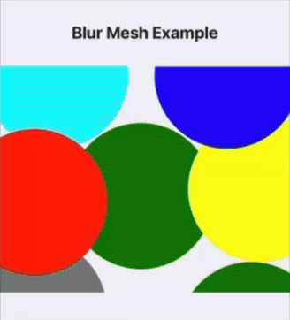

# react-native-skia-blur-mesh

Blurred color mesh backgrounds for React Native — soft gradient effects with colored shapes and Gaussian blur. All
animatable at 60fps on the UI thread.

Powered by [`@shopify/react-native-skia`](https://shopify.github.io/react-native-skia/).

## Preview


## Features

- **Soft gradients** — overlapping blurred shapes create organic mesh-gradient effects
- **Full animation support** — animate position, size, rotation, color, and blur per shape
- **Figma workflow** — define shapes in Figma coordinates, they scale automatically
- **No blur limit** — uses Skia ImageFilter, no 128 sigma cap
- **Per-shape controls** — individual color, size, rotation, position, blur radius
- **Cross-platform** — iOS & Android

## Installation

```bash
npm install react-native-skia-blur-mesh @shopify/react-native-skia react-native-reanimated
```

> **Peer dependencies:**
> - `@shopify/react-native-skia` >= 1.0.0
> - `react-native-reanimated` >= 3.0.0

## Usage

### Static mesh

```tsx
import {BlurMesh} from 'react-native-skia-blur-mesh';

<BlurMesh
    width={343}
    height={146}
    srcSize={{width: 343, height: 146}}
    defaultBlurRadius={185}
    shapeItems={[
        {
            color: 'rgba(176, 178, 255, 0.6)',
            size: {width: 595, height: 265},
            rotate: 0,
            topLeft: {x: -85, y: -113},
        },
        {
            color: '#DE67D2',
            size: {width: 380, height: 200},
            rotate: 0,
            topLeft: {x: 36, y: 139},
        },
        {
            color: '#FFF3C9',
            size: {width: 380, height: 200},
            rotate: 75,
            topLeft: {x: -219.23, y: 22.41},
        },
    ]}
>
    <View style={{flex: 1, justifyContent: 'center', alignItems: 'center'}}>
        <Text>Content on top</Text>
    </View>
</BlurMesh>
```

### Animated mesh (drifting shapes)

```tsx
import {BlurMesh} from 'react-native-skia-blur-mesh';
import {
    useSharedValue,
    withRepeat,
    withTiming,
    Easing,
} from 'react-native-reanimated';
import {useEffect} from 'react';

const AnimatedBackground = () => {
    const x1 = useSharedValue(-85);
    const y2 = useSharedValue(139);
    const rotate3 = useSharedValue(75);
    const color1 = useSharedValue('rgba(176, 178, 255, 0.6)');

    useEffect(() => {
        x1.value = withRepeat(
            withTiming(50, {duration: 4000, easing: Easing.inOut(Easing.ease)}),
            -1, true,
        );
        y2.value = withRepeat(
            withTiming(80, {duration: 3000, easing: Easing.inOut(Easing.ease)}),
            -1, true,
        );
        rotate3.value = withRepeat(
            withTiming(95, {duration: 5000, easing: Easing.inOut(Easing.ease)}),
            -1, true,
        );
        color1.value = withRepeat(
            withTiming('rgba(255, 150, 200, 0.6)', {duration: 3000}),
            -1, true,
        );
    }, []);

    return (
        <BlurMesh
            style={{flex: 1}}
            srcSize={{width: 343, height: 146}}
            defaultBlurRadius={185}
            shapeItems={[
                {
                    color: color1,
                    size: {width: 595, height: 265},
                    rotate: 0,
                    topLeft: {x: x1, y: -113},
                },
                {
                    color: '#DE67D2',
                    size: {width: 380, height: 200},
                    rotate: 0,
                    topLeft: {x: 36, y: y2},
                },
                {
                    color: '#FFF3C9',
                    size: {width: 380, height: 200},
                    rotate: rotate3,
                    topLeft: {x: -219.23, y: 22.41},
                },
            ]}
        >
            <Text>Animated mesh background</Text>
        </BlurMesh>
    );
};
```

> **Note:** For color interpolation inside Skia components, use `interpolateColors` from `@shopify/react-native-skia`,
> not `interpolateColor` from `react-native-reanimated`. Using Reanimated's version may cause colors to flash black during
> animation.

### Auto-sizing (no explicit width/height)

```tsx
<BlurMesh
    style={{flex: 1}}
    srcSize={{width: 343, height: 146}}
    shapeItems={shapeItems}
>
    {children}
</BlurMesh>
```

The component measures itself via `onLayout` when `width`/`height` are omitted.

## Figma Workflow

1. **Rotation is inverted**: Figma shows -75° → use `75` in code
2. **Take offsets at 0° rotation**: Read `topLeft` from Figma with rotation reset to 0
3. **Shapes are drawn in reversed order**: Bottom layer first — handled automatically

## API

### `<BlurMesh>` Props

| Prop                | Type                | Default    | Description                                   |
|---------------------|---------------------|------------|-----------------------------------------------|
| `shapeItems`        | `ShapeItem[]`       | required   | Array of blurred shape descriptors            |
| `srcSize`           | `{ width, height }` | required   | Figma reference size for proportional scale   |
| `defaultBlurRadius` | `number`            | `185`      | Default blur radius                           |
| `initialOffset`     | `{ x, y }`          | `{ 0, 0 }` | Global offset for all shapes                  |
| `width`             | `number`            | auto       | Component width                               |
| `height`            | `number`            | auto       | Component height                              |
| `style`             | `ViewStyle`         | —          | Style for the outer container                 |
| `children`          | `ReactNode`         | —          | Content rendered above the blurred background |

### `ShapeItem`

All numeric values and color accept `number/string | SharedValue` for animation.

| Prop         | Type                                                        | Default  | Description                               |
|--------------|-------------------------------------------------------------|----------|-------------------------------------------|
| `color`      | `Animatable<string>`                                        | required | Fill color (CSS color string)             |
| `size`       | `{ width: Animatable<number>, height: Animatable<number> }` | required | Shape size in design points               |
| `rotate`     | `Animatable<number>`                                        | required | Rotation in degrees (Figma sign inverted) |
| `topLeft`    | `{ x: Animatable<number>, y: Animatable<number> }`          | required | Position in design points                 |
| `shape`      | `BlurredShapeType`                                          | `oval`   | Shape type                                |
| `blurRadius` | `Animatable<number>`                                        | inherits | Per-item blur radius override             |

### `BlurredShapeType`

| Kind          | Props                                               | Description       |
|---------------|-----------------------------------------------------|-------------------|
| `oval`        | —                                                   | Ellipse (default) |
| `roundedRect` | `rx: Animatable<number>`, `ry?: Animatable<number>` | Rounded rectangle |
| `rect`        | —                                                   | Rectangle         |

## How it works

The component renders a Skia `<Canvas>` behind your children. Each shape item is drawn as a colored ellipse/rect with a
Gaussian blur (ImageFilter) applied. The shapes are positioned in a Figma-relative coordinate system and automatically
scaled to fit the component's actual dimensions. All animated values are read on the UI thread via `useDerivedValue` —
zero React re-renders during animation.

## License

MIT © [Vasyl Stetsiuk](https://github.com/vasyl-stetsiuk)
